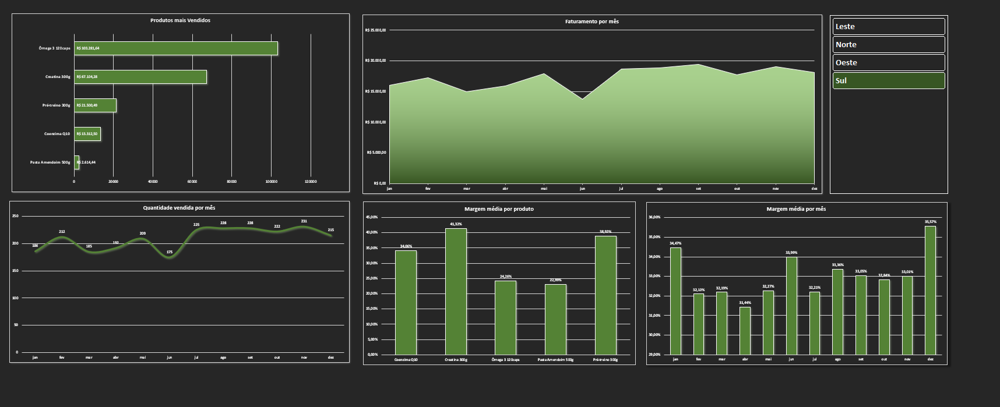
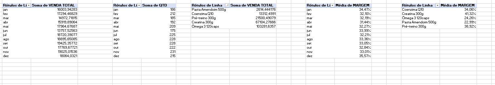
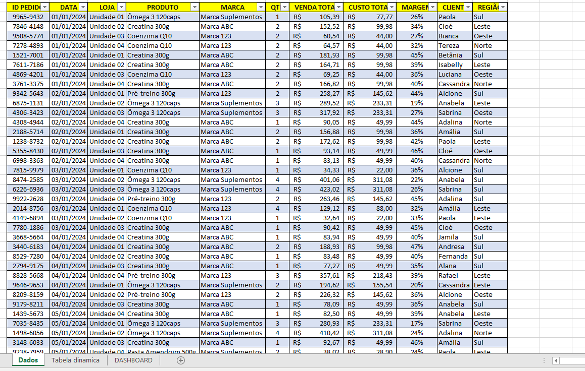

# 📊 Dashboard de Vendas - Excel

Este projeto consiste em um **dashboard interativo criado no Microsoft Excel**, com foco em análise de vendas, desempenho por produto e regiões do Brasil.

## ✅ Funcionalidades

- 📈 **Gráficos de Margem Média por Mês**
- 📈 **Gráficos de Margem Média por Produto**
- 📊 **Produtos Mais Vendidos**
- 📦 **Quantidade Vendida por Mês**
- 💰 **Faturamento por Mês**
- 🌎 **Filtro Dinâmico por Região** (Leste, Norte, Oeste, Sul)

## 🧰 Tecnologias Utilizadas

- Microsoft Excel
- Tabelas Dinâmicas
- Segmentação de Dados
- Gráficos de Colunas, Linhas e Área
- Formatação Condicional

## 📸 Preview do Dashboard

### 🎯 Visão Geral

### 🔍 Tabela Dinâmica

### 📋 Dados Originais

